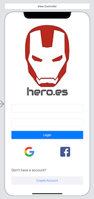
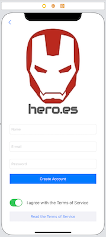
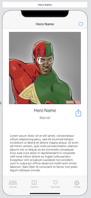
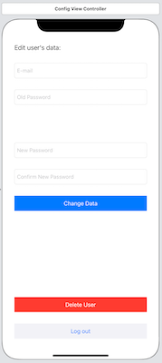

<!-- Images Badges -->
[swift-image]: https://img.shields.io/badge/Swift-5.2-orange.svg?style=flat
[xcode-image]: https://img.shields.io/badge/xcode-11.3-orange
[cocoapods-image]: https://img.shields.io/badge/CocoaPods-1.10-orange

<!-- URLs -->
[xcode-url]: https://developer.apple.com/xcode/
[swift-url]: https://swift.org/
[mac-url]: https://www.apple.com/br/macos/catalina/
[cocoapods-url]: https://cocoapods.org
[firebase-url]: https://firebase.google.com
[firebase-pod-url]: https://firebase.google.com/docs/ios/setup
[alamofire-url]: https://cocoapods.org/pods/Alamofire 
[kingfisher-url]: https://cocoapods.org/pods/Kingfisher
[swiftyjson-url]: https://cocoapods.org/pods/SwiftyJSON
[santander-mobile-coders-url]: https://www.becas-santander.com/pt/program/santander-coders-mobile-2020
[digital-house-url]: https://www.digitalhouse.com/br/
[curso-ios-url]: https://www.digitalhouse.com/br/curso/desenvolvimento-mobile-ios

# Digital House | Projeto Integrador | Heroes

Projeto Integrador para obter o Certificado de Conclusão do curso de [Desenvolvimento Mobile iOS/Swift][curso-ios-url] pela [Digital House][digital-house-url] em parceria com o [Santander Mobile Coders][santander-mobile-coders-url].

[![Swift][swift-image]][swift-url]
[![Xcode][xcode-image]][xcode-url]
[![CocoaPods][cocoapods-image]][cocoapods-url]

# Tópicos

- [Tópicos](#tópicos)
- [Requerimentos](#requerimentos)
  - [Swift](#swift)
  - [Xcode](#xcode)
  - [CocoaPods](#cocoapods)
  - [macOS](#macos)
- [Descrição](#descrição)
- [Funcionalidades Previstas](#funcionalidades-previstas)
- [Imagens do Projeto](#imagens-do-projeto)
- [Requisitos do Projeto](#requisitos-do-projeto)

# Requerimentos

Para utilizar a aplicação é necessário atender os seguintes requisitos:

- Swift 5 ou superior
- Xcode 11.3 ou superior
- CocoaPods 1.10 ou superior
- macOS 10.14 (Mojave) ou superior
- RAM 8GB ou superior
- HD 128GB ou superior

## Swift

Swift é uma linguagem de programação orientada a objetos, com tipagem forte e permite o desenvolvimento utilizado múltiplos paradigmas.
Mais informações podem ser obtidas clicando no seguinte link [Swift][swift-url].

## Xcode

É uma Ferramenta de Desenvolvimento Integrado ou IDE na sigla em inglês.
É a ferramenta sugerida pela Apple que é detentora da marca e da linguagem.

Mais informações, clique no link [Xcode][xcode-url].

## CocoaPods

É um gerenciador de dependências para bibliotecas escritas em Objective-C e Swift. É um dos gerenciadores mais populares para Desenvolvimento iOS/Swift, se não, o mais popular.

Para obter mais informações a respeito do CocoaPods, basta clicar neste link: [CocoaPods][cocoapods-url].

As bibliotecas utilizadas até o momento são:

- Firebase
- Alamofire
- Kingfisher
- SwiftyJSON

### Firebase

Firebase é um serviço Serverless para hospedagem de sites estáticos, banco de dados em tempo real, banco de dados offline, autenticação de usuários, entre outros. A empresa responsável pelo [Firebase][firebase-url] é o Google.

A biblioteca utiliza os serviços de autenticação de usuários e banco de dados Firestore.

Para obter mais informações, clique em [pod Firebase][firebase-pod-url].

### Alamofire

Alamofire é uma biblioteca de requisições HTTP para iOS/Swift. É uma das mais utilizadas por desenvolvedores, pois facilita o gerenciamento de requisições HTTP, parsing de JSON, entre outros.

Acaso queira saber mais, clique em [Alamofire][alamofire-url].

### KingFisher

KingFisher é uma biblioteca de carregamento de imagens, caching, entre outras funcionalidades para iOS/Swift.

Cliquem [aqui][kingfisher-url] para saber mais.

### SwiftyJSON

SwiftyJSON é uma biblioteca para serialização e desserialização Swift com foco em parsing de JSON.

Para obter mais informações, clique em [SwiftyJSON][swiftyjson-url].

[Voltar ao menu](#tópicos)

## macOS

É o sistema operacional utilizado para o desenvolvimento de aplicativos mobile iOS.

É possível obter mais informações clicando no seguinte hyperlink [macOS][mac-url].

[Voltar ao menu](#tópicos)

# Descrição

Este projeto visa criar um aplicativo iOS 13+ para aficionados em super-heróis, principalmente da Marvel, onde poderão compartilhar heróis favoritos e revistas, inicialmente.

# Funcionalidades Previstas

As funcionalidades previstas para o projeto são:

- Gereciamento de heróis
- Gerenciamento de revistas
- Compartilhamento de heróis e revistas
- Salvar heróis e revistas como favoritos
- Armazenamento offline
- Login social usando Facebook e Google
- Entre outros

[Voltar ao menu](#tópicos)

# Imagens do Projeto

As imagens abaixo mostram um pouco a respeito do aplicativo em funcionamento.

## Aplicativo Rodando

Amostra do aplicativo em execução.

## Tela Inicial

Tela de início da aplicação. Permite o login social por meio do Facebook e do Google. Além disso, é possível navegar para o cadastro de usuário.

## Cadastro

Permite o cadastro de usuário por meio de e-mail e senha mediante o aceite dos Termos de Uso.

## Lista de Heróis

Lista de todos os heróis disponíveis. É possível favoritar ou compartilhar, além de busca por termo.

## Detalhes de Herói

Permite visualizar os detalhes do heróis e as revistas relacionadas. É possível favoritá-lo ou compartilhá-lo.

## Configuração

Permite configurar os dados da conta, tais como: troca de senha exclusão de conta.

[Voltar ao menu](#tópicos)

# Requisitos do Projeto

Para obter o Certificado de Conclusão, é necessário implementar o projeto atendendo os seguintes requisitos:

- &check; Deve possuir um design em todas as telas utilizando auto layout;
- &check; Aplicação do POO.
- &cross; Deve possuir navegação entre telas (Navigation e Modal);
- &check; Tratativas de erros;
- &check; Deve consumir uma API;
- &cross; Deve funcionar em modo offline;
- &cross; A arquitetura deve ser MVVM;
- &cross; O código precisa estar comentado;
- &cross; Testes Unitários;
- &check; O app deve conter, pelo menos, os seguintes componentes do UIKit: (UITextField, 
UIButton, UILabel, UICollectionView e UITableView).
- &cross; O app deve possuir as seguintes features:
    - &cross; Tela de carregamento;
    - &cross; Tela de login (Facebook e Google são obrigatórios);
    - &cross; Tela inicial que deve conter um resumo das funcionalidades do app;
    - &cross; Tela de descrição do item;
    - &cross; Tela de listagem de características;
    - &check; Opções para compartilhamento em redes sociais;
- &check; Todo o trabalho deve ser feito utilizando o GitFlow;
- &cross; Ao final, o ReadMe deve estar atualizado com screenshots das telas do app e descrição detalhada das funcionalidades.

[Voltar ao menu](#tópicos)